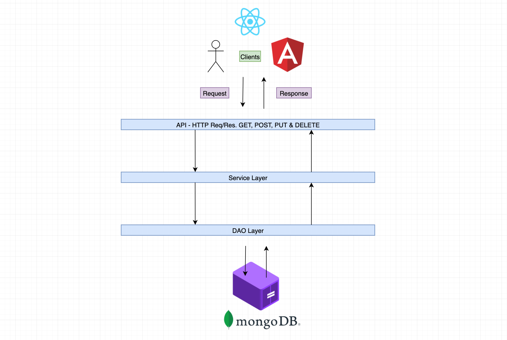

# Build a Rest Api with MongoDB

How to create a spring boot api connected with mongo db using spring data mongodb

#Docker #SpringBoot #MongoDb

### Application Architecture Diagram

###   Here are the things about that project
🙊
► Recommended Books

Clean Code
- https://amzn.to/2UGDPlX

HTTP: The Definitive Guide
- https://amzn.to/2JDVi8s

Clean Architecture
- https://amzn.to/2xOBNXW